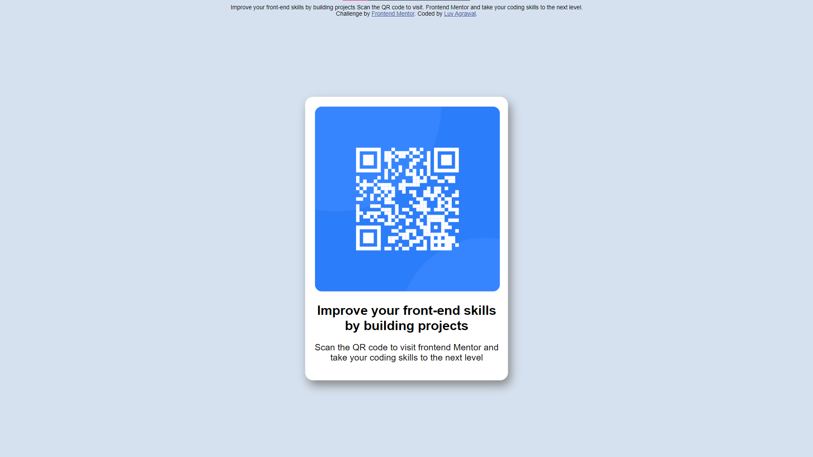

# Frontend Mentor - QR code component solution

This is a solution to the [QR code component challenge on Frontend Mentor](https://www.frontendmentor.io/challenges/qr-code-component-iux_sIO_H). Frontend Mentor challenges help you improve your coding skills by building realistic projects. 

## Table of contents

- [Overview](#overview)
  - [Screenshot](#screenshot)
  - [Links](#links)
  - [Built with](#built-with)
  - [What I learned](#what-i-learned)
  - [Continued development](#continued-development)
  - [Useful resources](#useful-resources)
- [Author](#author)

## Overview
This is my solution to the project. I have tried to make it as responsive as possible

### Screenshot

### Links

- Live Site URL: (Learning soon! Stay tuned 😉)

### Built with

- Semantic HTML5 markup
- CSS custom properties
- Responsive sizes
- Basic HTMLs
- [Styled Components](https://styled-components.com/) - For styles

### What I learned

During this project I learned to face the challenges of centering a div, The necessity and need of responsiveness webpage.
I have also commented out some other ways that worked to center the div.

### Continued development

I'll learn more and more about how to create responsive and reactive websites.

### Useful resources

- [CSS](https://www.freecodecamp.org) - This helped me learn CSS. I really liked this pattern and will use it going forward.

## Author

- Frontend Mentor - [@LuvAgrawal](https://www.frontendmentor.io/profile/LuvAgrawal)
- LinkedIn - [@LuvAgrawal](https://www.linkedin.com/in/LuvAgrawal)
