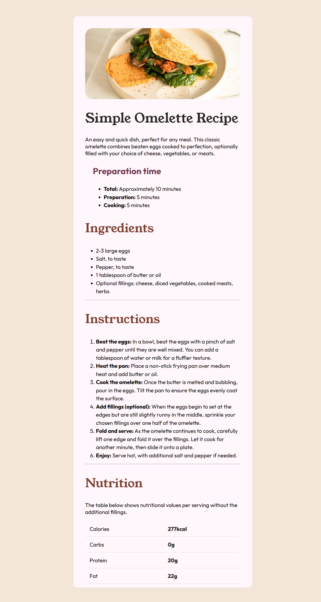

# Overview

This is a solution to the [Recipe page challenge on Frontend Mentor](https://www.frontendmentor.io/challenges/recipe-page-KiTsR8QQKm). As you go through the code you'll notice that i stuggle with centering the div. Looking forward to hear from you about how I did the project 😃! 

## Table of contents

- [Overview](#overview)
  - [Screenshot](#screenshot)
  - [Links](#links)
- [My process](#my-process)
  - [Built with](#built-with)
  - [What I learned](#what-i-learned)
- [Author](#author)

**Note: Deete this note and update the table of contents based on what sections you keep.**

### Screenshot

### Links

- Solution URL: [Add solution URL here](https://your-solution-url.com)
- Live Site URL: [Add live site URL here](https://your-live-site-url.com)

## My process

I started with the Html then made the CSS where i tried to make it as responsive as possible. I learned about centering a div in the project.

### Built with

- Semantic HTML5 markup
- CSS custom properties
- CSS Grid

## Author

- Frontend Mentor - [@LuvAgrawal](https://www.frontendmentor.io/profile/LuvAgrawal)
- LinkedIn - [@LuvAgrawal](https://www.linkedin.com/in/luvagrawal)
- Github - [@LuvAgrawal](https://github.com/LuvAgrawal)